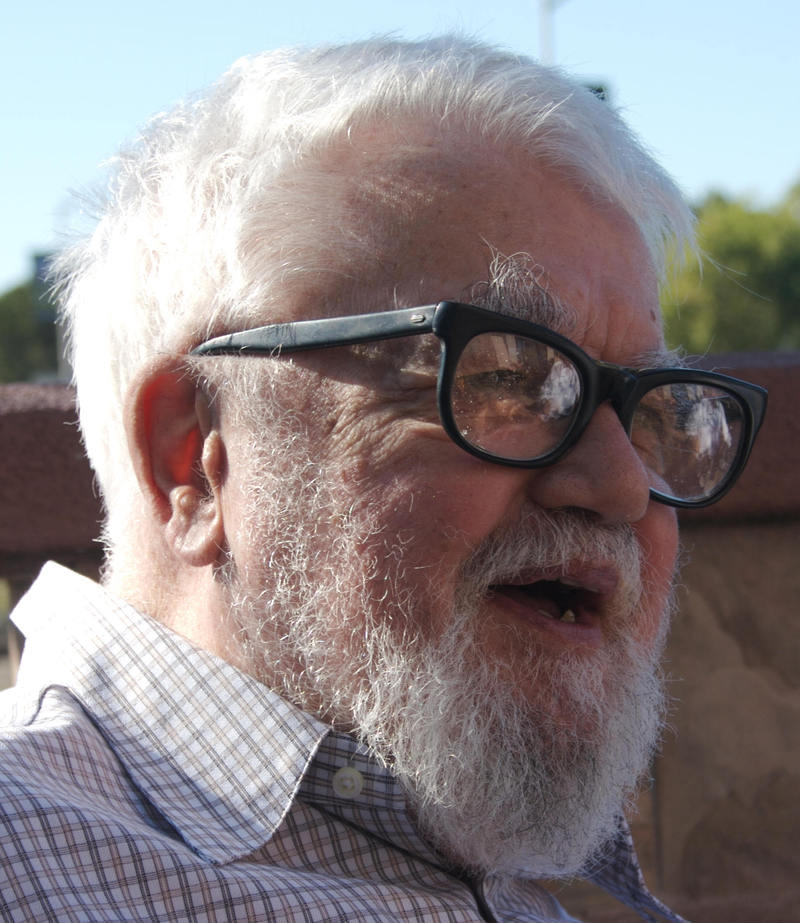

% Babel Tower Meets JVM
% Éric Lefevre-Ardant - Arnaud Bailly
% 2012/04/06

# Agenda

- Intro
- Fantom
- Frege
- Ioke
- Common Lisp
- Outro
- Discussion

# Introduction

# Why Different Languages?

- Java has evolved: Once a fringe language for *applets* on the web, now a full-fledged ecosystem
- JVM is a sophisticated and performant runtime abstracting away from (most of) the gory hardware details
- Java The Language has not evolved as much as the Java The Platform
- Class-Based Statically-Typed Object-Orientation is *One* paradigm of programming
- Some languages are closer to some problems expression than other

# Fantom: A better Java

# Fantom

# Frege: Haskell on the JVM

# Frege

# Ioke: Prototypes Everywhere

# Ioke 

# Common Lisp: More Parens

# Common Lisp

# References

- [Seven Languages in Seven Weeks](http://pragprog.com/book/btlang/seven-languages-in-seven-weeks)
- [Fantom](http://fantom.org/)
- [Ioke](http://ioke.org/)
- [Frege](http://code.google.com/p/frege/)
- [Common Lisp](http://common-lisp.net/project/armedbear/)

# Credits

- [Fantomas](http://www.mobipocket.com/eBooks/cover_remote/ID1793/fantomas%20900.jpg)
- [Gottlöb Frege](http://www.yourbest100.com/pic/people/philosophers/gottlob-frege.jpg)
- [Ioke](http://upload.wikimedia.org/wikipedia/commons/a/a8/Hurricane_Ioke,_MODIS_image_on_August_24,_2006,_2155_UTC.jpg)
- [John McCarthy](http://www.alpcentauri.info/John_McCarthy_Stanford.jpg)
